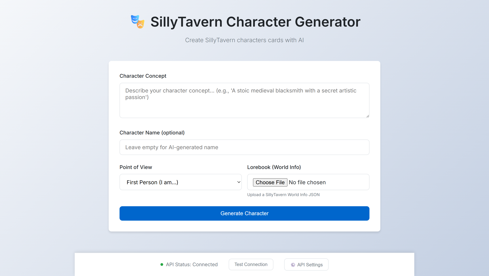
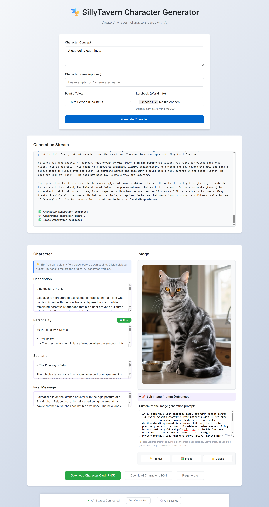

# SillyTavern Character Generator (v2)




Web app for generating, editing, importing, revising, and exporting SillyTavern character cards (Spec V2).

## What Changed In v2

- Import existing cards (`.png` with embedded data or `.json`) and edit them in-place.
- Revise an existing card with AI using natural-language instructions.
- Local IndexedDB library for saved prompts and cards (load/delete from UI).
- Reference image flow with optional vision-based auto-description.
- Streaming generation output with stop support.
- Better API key handling: session-only by default, optional persistent storage toggle.

## Features

- AI character generation (first-person or third-person POV templates).
- Optional lorebook (SillyTavern World Info JSON) grounding during generation.
- AI image prompt generation with editable prompt box (up to 1000 chars).
- Image controls: regenerate prompt, regenerate image, or upload your own image.
- Export to:
  - SillyTavern PNG card with embedded `chara_card_v2` metadata
  - JSON (`chara_card_v2` structure)
- Per-field reset buttons for reverting edits to the last generated/imported baseline.

## Requirements

- Node.js 18+ recommended
- OpenAI-compatible text API endpoint (required)
- OpenAI-compatible image API endpoint (optional)
- Vision-capable text model (optional, only needed for reference-image auto-description)

## Quick Start

### Local (Dev)

```bash
npm install
cd proxy && npm install && cd ..
npm run dev
```

- Frontend: `http://localhost:2427`
- Proxy API: `http://localhost:2426`

### Local (Non-dev)

```bash
npm start
```

### Docker Compose

```bash
cp .env.example .env
docker compose up -d --build
```

- Frontend: `http://localhost:${FRONTEND_PORT:-2427}`
- Proxy health: `http://localhost:${PROXY_PORT:-2426}/health`

## Configuration

Environment (`.env`):

| Variable | Default | Description |
| --- | --- | --- |
| `FRONTEND_PORT` | `2427` | Host port mapped to frontend container |
| `PROXY_PORT` | `2426` | Host port for proxy server |
| `FRONTEND_URL` | `http://localhost:2427` | Used by proxy CORS/OpenRouter headers |

In-app API Settings:

- Text API Base URL, API Key, Text Model, optional Vision Model
- Image API Base URL, API Key, Image Model, optional size
- `Persist API keys` toggle (off by default)
- `Enable image generation` toggle

## Usage

1. Open API settings and configure text API (required).
2. Enter a character concept (and optional fixed name).
3. Optionally upload a lorebook JSON.
4. Optionally upload a reference image (auto-described if vision model is configured).
5. Generate character.
6. Edit fields, revise with AI, or import/export as needed.

## API Compatibility Notes

- The frontend calls only the local proxy (`/api/...`).
- The proxy forwards to your configured upstream API URL.
- Proxy tries `Authorization: Bearer ...` first, then retries with `X-API-Key` on 401.

## Project Structure

- `index.html` - UI shell
- `src/scripts/` - frontend logic (generation, API calls, image handling, storage)
- `proxy/server.js` - Express proxy for text/image endpoints and image passthrough
- `src/scripts/storage.js` - IndexedDB prompt/card library

## License

MIT. See `LICENSE`.
